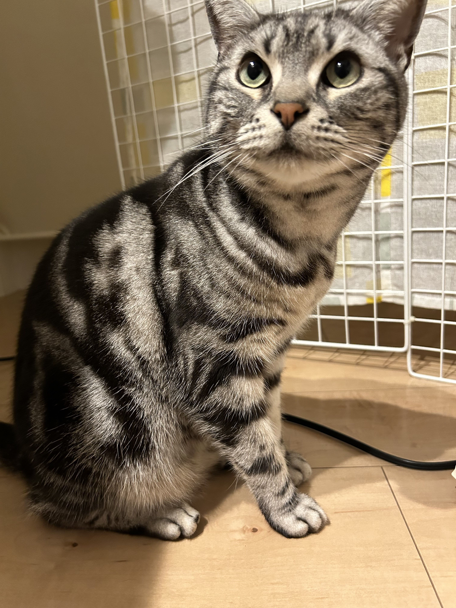
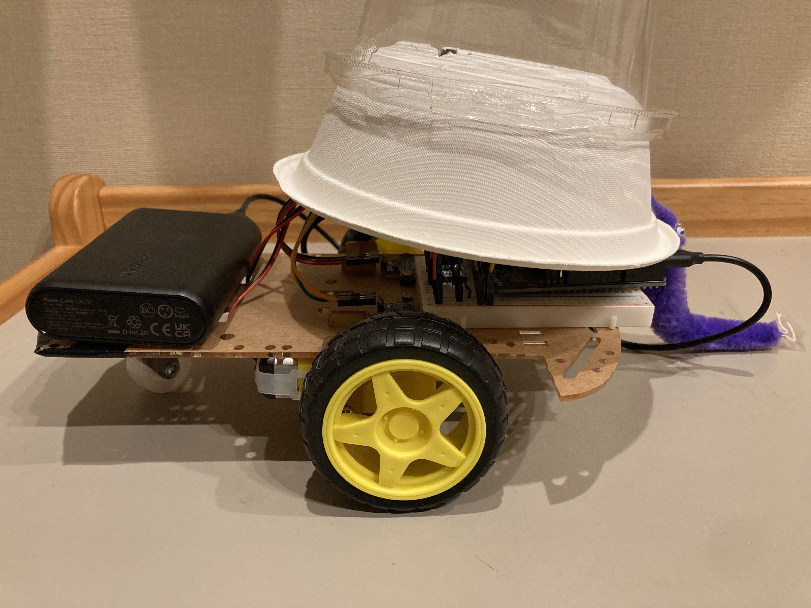
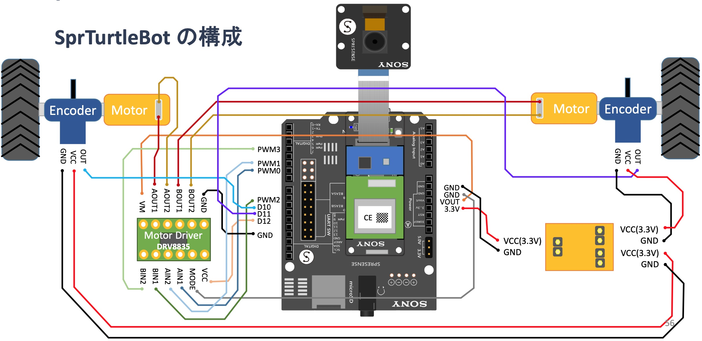
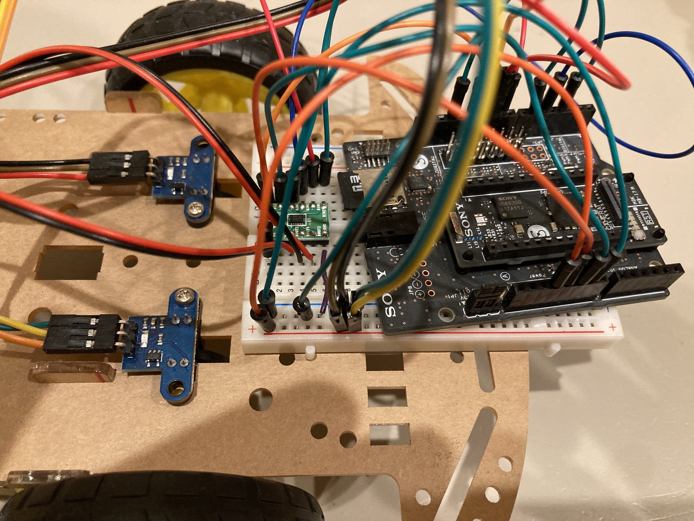
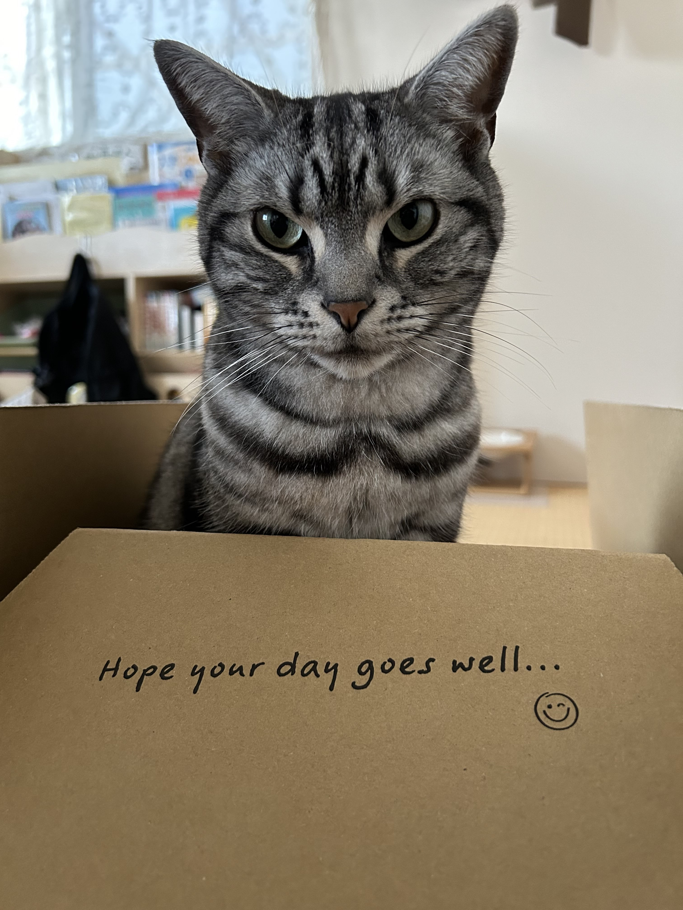

# 猫の日開催！ ねこIoTLT vol.9 
猫も参加するLT会

【Spresense 猫モーラー😺】

2024/2/22

＠juraruming & りく

<!--
_class: lead
_paginate: false
_header: ""
footer: ""
-->

# 目次
- 自己紹介
- つくったもの
- 参考資料

<!--
_header: ""
_footer: "" 
-->
# 自己紹介

- 名前: りく
- 年齢: 7才
- 性別: おとこの子♂
- 好きなおもちゃ: じゃらし
- 好きなおやつ: ちゅるビ〜、ねこ福、チュール

# 自己紹介
- 名前: 阿部　耕二（あべ　こうじ）
- 医療機器の組込みソフトウェア開発。C言語。
- 趣味: 宇宙開発（[リーマンサットプロジェクト](https://www.rymansat.com/)広報メンバー）
- LAPRASポートフォリオ: https://lapras.com/public/k-abe
- X（Twitter）: @juraruming

# つくったもの
* **Spresense猫モーラー😺**をつくった。
* [micro:bitやM5Stackでつくる　ネコと楽しむ　電子ニャン工作](https://shop.rutles.net/?pid=176719621)に掲載のモーラーを参考にした。

* 製作詳細記事は[elchikaの記事](https://elchika.com/article/8fe1b130-163d-480d-9b82-f01a6026fc42/)を参照

## ローバー部分について
* オープンソースのローバーを流用
Spresense-microROS-Seminar:
https://github.com/TE-YoshinoriOota/Spresense-microROS-Seminar

* CQ出版 トランジスタ技術2023年4月号で紹介されていたローバー
* 左右のDCモーターをPWM制御で駆動する
* エンコーダーで速度を算出する

## Spresense

* 配線図: 
[Spresense とmicro-ROS ではじめるロボットプログラミング.pdf](https://github.com/TE-YoshinoriOota/Spresense-microROS-Seminar/blob/main/Documents/Spresense%20%E3%81%A8micro-ROS%20%E3%81%A7%E3%81%AF%E3%81%98%E3%82%81%E3%82%8B%E3%83%AD%E3%83%9C%E3%83%83%E3%83%88%E3%83%97%E3%83%AD%E3%82%B0%E3%83%A9%E3%83%9F%E3%83%B3%E3%82%B0.pdf) p56より 

## 技術的なこと
* メインコア、サブコア1つのマルチコア構成

* サブコアでモーター駆動パラメータをランダムに生成
  * 移動スピード -1.0〜1.0(m/s)（0 <= 1は前進、-1 <= 0は後進）
  * 移動方向 前進・後進（0）、右回り（-1）、左回り（1）

* メインコアはモーター駆動パラメータでモーターを駆動する

## 成果物
* Spresense猫モーラー😺のソースコード
  * GitHub:　https://github.com/grace2riku/cat_moeller_spresense

* 動画
  * https://www.youtube.com/shorts/9DEYoG3bVgM

## 今後の課題
* ROS２との接続
参考資料[Spresense とmicro-ROS ではじめるロボットプログラミング.pdf](https://github.com/TE-YoshinoriOota/Spresense-microROS-Seminar/blob/main/Documents/Spresense%20%E3%81%A8micro-ROS%20%E3%81%A7%E3%81%AF%E3%81%98%E3%82%81%E3%82%8B%E3%83%AD%E3%83%9C%E3%83%83%E3%83%88%E3%83%97%E3%83%AD%E3%82%B0%E3%83%A9%E3%83%9F%E3%83%B3%E3%82%B0.pdf)のp68以降はROS2と接続し各種動作を確認している。
Spresense猫モーラーをROS2と接続してみたい。

* IoT LTなのにネット接続の要素技術を現段階では使っていない😅

# 参考資料
<!--
_footer: "" 
-->
1. [micro:bitやM5Stackでつくる　ネコと楽しむ　電子ニャン工作](https://shop.rutles.net/?pid=176719621)
今回のモーラーは【第１章　ネコわくわく 電子おもちゃ編 -> ネコモーラーで遊んでほしい！】を参考にした

2. [Spresense とmicro-ROS ではじめるロボットプログラミング.pdf](https://github.com/TE-YoshinoriOota/Spresense-microROS-Seminar/blob/main/Documents/Spresense%20%E3%81%A8micro-ROS%20%E3%81%A7%E3%81%AF%E3%81%98%E3%82%81%E3%82%8B%E3%83%AD%E3%83%9C%E3%83%83%E3%83%88%E3%83%97%E3%83%AD%E3%82%B0%E3%83%A9%E3%83%9F%E3%83%B3%E3%82%B0.pdf)

---

ご清聴ありがとうございました🙇🐾

