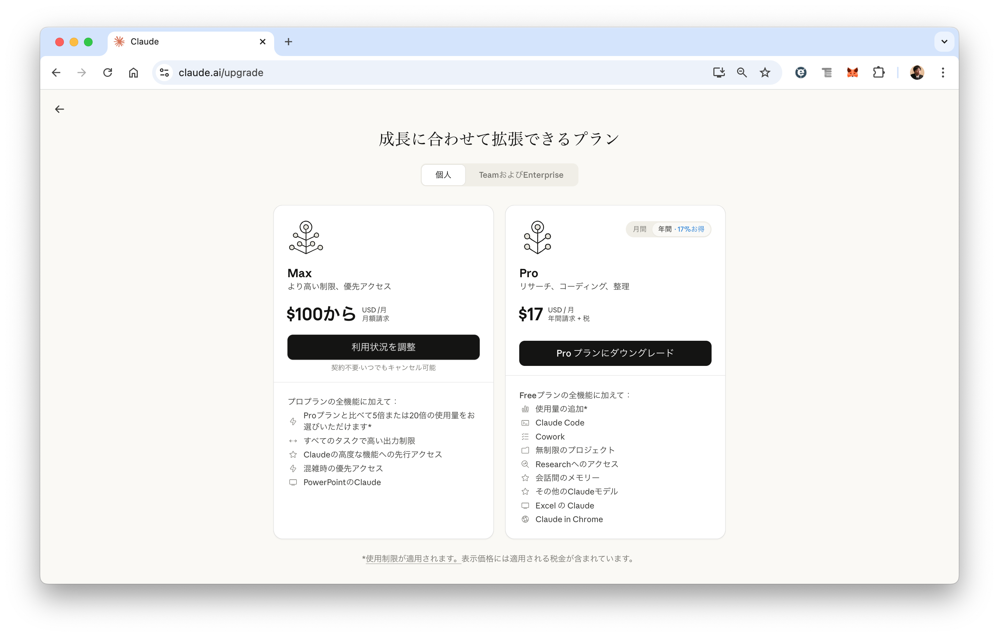
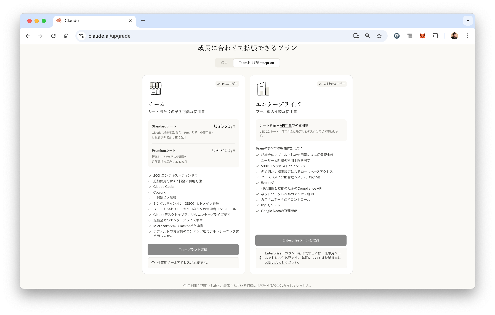
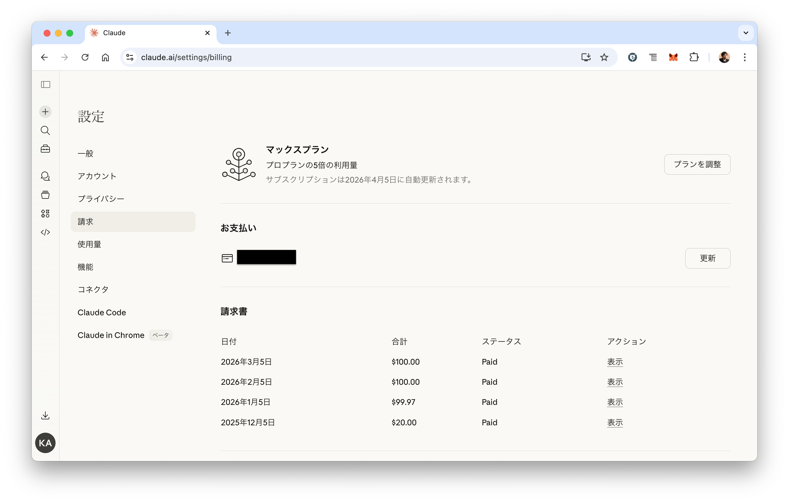
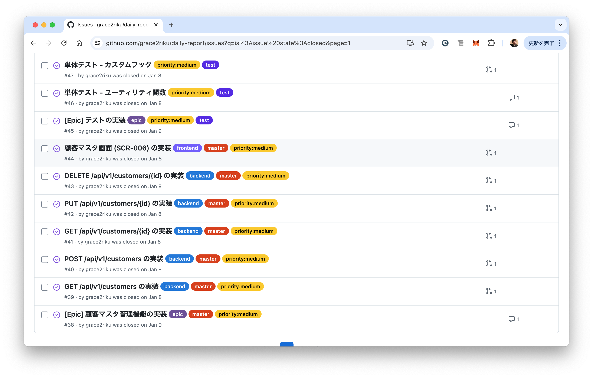

# Claude Code使⽤感の報告会<br>（2026年3月）

パーソルクロステクノロジー株式会社
エンジニアリング事業管掌　設計統括本部
第2電子・制御設計本部　第1設計部　5G　阿部耕二

<!--
_class: lead
_paginate: false
_header: ""
footer: ""
-->

---
目次
- 自己紹介
- Claude Codeを使うためにかかるコスト
- 環境構築
- 事例紹介1: チャット Webアプリ
- 事例紹介2: 営業日報システム Webアプリ
- 事例紹介3: 既存プロダクト（組込みソフトウェア）の分析
- Claude Codeを使って嬉しかったこと
- Claude Codeを使って困ったこと
- Claude Codeの使い方をある程度覚えた今、思っていること
- 参考資料

<!--
_header: ""
_footer: "" 
-->

# 自己紹介
- 名前: 阿部　耕二（あべ　こうじ）
- 所属: パーソルクロステクノロジー株式会社
エンジニアリング事業管掌　設計統括本部
第2電子・制御設計本部　第1設計部　5G
- 医療機器の組込みソフトウェア開発。C言語。
- LAPRASポートフォリオ: https://lapras.com/public/k-abe
- X: [@juraruming](https://x.com/juraruming)


# Claude Codeを使うためにかかるコスト



## チーム、エンタープライズ


## 私のプラン


# 環境構築
- Claude Codeと**ghコマンド**の連携は是非ともオススメ
 - リポジトリ作成、Issueの作成、プルリクエスト、レビューなどがターミナルで完結します。
 - 圧倒的開発体験が得られて感動しました。

# 事例紹介1: チャット Webアプリ
- 参考資料1. [Claude CodeによるAI駆動開発入門](https://gihyo.jp/book/2025/978-4-297-15275-8)を写経

- GitHubリポジトリ：
https://github.com/grace2riku/ai-chat


## 試したこと
■MCP 
Claude Codeと他のアプリケーションとのやりとりを仲介してくれる通信規格
- Context7：ライブラリの最新のドキュメントを参照してくれる
- Playwright：ブラウザを操作してテストを自動化する

---

■要件定義
- Claude Codeと共同して行い、CLAUDE.mdにまとめる

- プロンプト：
```
> AIチャットボットを作りたいです。仕様書をあなたと一緒に作りたいので、必要な情報は質問してもらえますか?最後に CLAUDE.md ファイルを出力するのが目的です。
```

- CLAUDE.md
https://github.com/grace2riku/ai-chat/blob/main/CLAUDE.md

---

■タスクの管理
- 要件定義した内容を実現するための実行計画を立てる。
  - TODO.mdが作成された。チェックボックス付き

- プロンプト：
```
現在のアプリケーションを構築するための実行計画を立ててください。それをTODOリストとしてMarkDownファイルに落としてください。
```

- TODO.md
https://github.com/grace2riku/ai-chat/blob/main/TODO.md

---

■実装
- TODO.mdを元に実装してもらう。

プロンプト：
```
@TODO.md これを元にフェーズ1の実装をお願いします。終わったらチェックボックスにチェックをしてください。use context7
```

- ここでuse context7を使っている。CLAUDE.mdでNext.jsを使うと書いている。Next.jsのドキュメントを参照して実装してくれる（らしいです）。


# 事例紹介2: 営業日報システム Webアプリ
- 参考資料1. [Claude CodeによるAI駆動開発入門](https://gihyo.jp/book/2025/978-4-297-15275-8)を写経

- GitHubリポジトリ：
https://github.com/grace2riku/daily-report


## 試したこと
■要件定義をCLAUDE.md に書いてもらう。
- 設計書（画面設計、テスト、その他）も書いてもらい、CLAUDE.mdから参照する。
- 要件を実現するための使用技術をCLAUDE.mdに追加した。

- CLAUDE.md
https://github.com/grace2riku/daily-report/blob/main/CLAUDE.md

---
■ガードレールの用意

- **ガードレール**の意味
  - AIが期待しない動作をしないように準備しておく
- 守るべき仕様や規約を与える。
  - 例）コードの命名規則の統一
  - 例）コードの記法のルールの統一

- リンター(ESLint)の設定をいれた。
- Huskyを入れてGitコミットやプッシュの前にリンターを実行させるようにした。


---
■CI/CDの設定

Claude Codeに実装を書いてもらう
→プッシュ前にリンター・テストを実行
→デプロイ

の流れを作成してもらった。


---
■GitHubのIssueを作成してもらう

- プロンプト：
```
現在の仕様と構成に従ってまずIssueを細かく具体的に立ててください。それをghコマンドでGitHubにデプロイしてください。ultrathink
```

- 「細かく具体的に」の指示が個人的に重要だと思っている。
  - 大きい粒度のIssueにするとAIの成果物も安定しない（ような気がします）。

- ultrathinkはよく考えて精度の高い回答を行う。トークンを多く消費する。

---
作成されたIssue。ラベル（frontend, backend, その他）もつけてくれてありがたい。



---
■実装
- 作成したIssueを指定し実装を指示する。
- gitを使った変更管理を意識した指示をする。
- 「ブランチを切って作業し、最後にプルリクエストしてください。」を入れないとメインブランチで作業する、コミットしてもプルリクエストまで出してくれなかったりする。

- プロンプト：
```
Issue #1を実装してください。use context7
ブランチを切って作業し、最後にプルリクエストしてください。
```

---
⚫︎レビュー
- プルリクエストをレビューする。
- プロンプト：
```
PR #1の内容をレビューしてください。
プルリクエストのコメントとしてレビュー内容を記述してください。
```

- レビューの一例
https://github.com/grace2riku/daily-report/pull/56#pullrequestreview-3618259265

---
⚫︎GitWorktreeによる並行処理
- GitWorktreeは同じGitリポジトリの別ブランチを別ディレクトリにチェックアウトできる。
- フロントエンドのIssueの#xはターミナル1で実装する。バックエンドのIssue #yはターミナル2で並行して行う、みたいなことができる。

---
- 例1-1) ターミナル1でClaude Codeを起動し、Issue #2（バックエンド）のIssueを対応する。
- プロンプト：
```
Issue #2を実装してください。別ブランチを立てて、最後プルリスエストをお願いします。
```

- 例1-2) ターミナル2でClaude Codeを起動し、Issue #3（フロントエンド）のIssueを対応する。
- プロンプト：
```
Issue #3を実装してください。git worktreeを使ってサブフォルダを作り別ブランチを立てて、最後プルリクエストをお願いします。
サブフォルダは`issue-***'という命名規則に従ってください。
```

---
- フロントエンドのIssue、バックエンドのIssueを並行で実装させたのは、競合が起きにくいだろう、という考えからそうしている。

- GitWorktreeによる並行処理でIssueは早く対応できるようになったが、Proプランの使用制限にひっかかり5時間待たされることが多くなってきた。
Pro→Maxプランへ切り替え、その後は使用制限がかかることはなくなった。現在も快適に使えている。


---
■サブエージェント

---
■カスタムスラッシュコマンド

---
■Agent Skills


# 事例紹介3: 既存プロダクト<br>（組込みソフトウェア）の分析


# Claude Codeを使って嬉しかったこと
1. 開発が楽しい
2. gitコミットログを考えて書かなくなり楽になったこと
3. イシューの作成が楽になったこと
4. GitHubリポジトリのプロダクトなどを分析、レポート化し自分の知らない技術を知れること

# Claude Codeを使って困ったこと
1. Claude Codeを使うことが目的になっている時があること
2. 期待するアウトプットが得られない時があること
3. Claude Codeのアップデートが早すぎて、新機能のキャッチアップができなくて焦ること

# Claude Codeの使い方をある程度覚えた今、思っていること
1. エージェント型コーディングAIの使い方ではなく、正しく動く仕組みが重要ではないかと思っていること

# 参考資料
<!--
_footer: "" 
-->
1. [Claude CodeによるAI駆動開発入門](https://gihyo.jp/book/2025/978-4-297-15275-8)
2. [実践Claude Code入門<br>―現場で活用するためのAIコーディングの思考法](https://gihyo.jp/book/2026/978-4-297-15354-0)


---

ご清聴ありがとうございました🙇